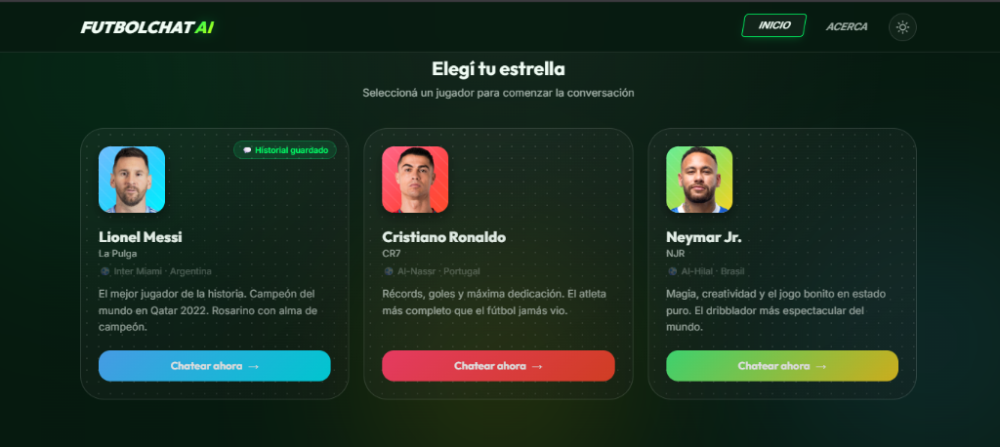
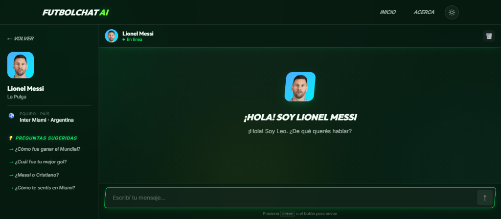
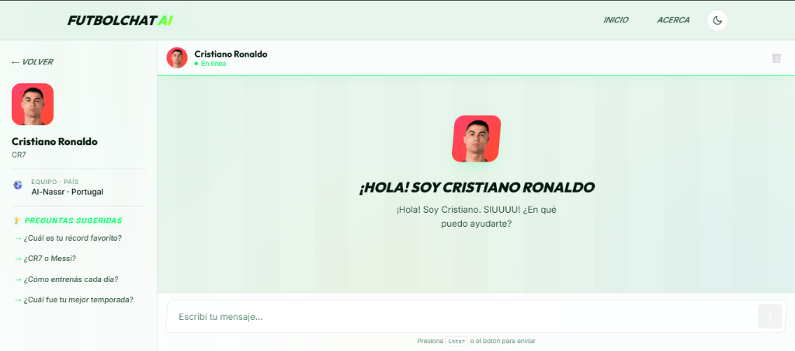
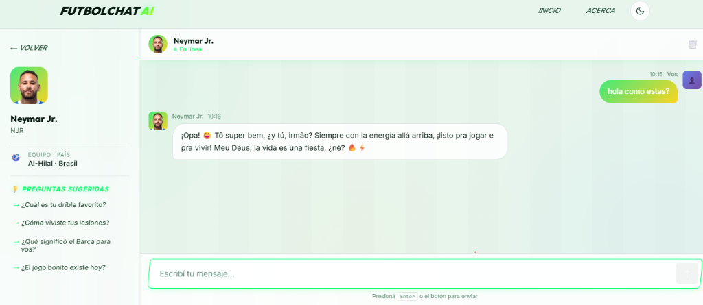

# ⚽ FutbolChat AI

> Chateá con Messi, Cristiano Ronaldo y Neymar usando inteligencia artificial real.

SPA desarrollada para el **Proyecto Integrador – PIM3 Full Stack**.

---

## 🌐 Link a la aplicación desplegada

👉 **[https://futbolchat-ai.vercel.app](https://futbolchat-ai.vercel.app)**

---

## 👥 Los Personajes

| Jugador           | Apodo      | País          | Descripción                                                                       |
| ----------------- | ---------- | ------------- | --------------------------------------------------------------------------------- |
| **Lionel Messi**  | La Pulga 🐐 | 🇦🇷 Argentina | 8 Balones de Oro, Campeón del Mundo 2022. Habla con modismos rioplatenses.        |
| **Cristiano Ronaldo** | CR7 💪 | 🇵🇹 Portugal | 5 Balones de Oro, máximo goleador de la historia. Seguro de sí mismo, dice SIUUUU. |
| **Neymar Jr.**    | NJR ⚡      | 🇧🇷 Brasil    | Campeón Olímpico, el jogo bonito. Alegre, mezcla palabras en portugués.           |

Cada personaje tiene un **system prompt único** que define su personalidad, forma de hablar y conocimiento. Los prompts solo viven en el servidor (Vercel Function) y nunca se exponen al cliente.

---

## 🛠️ Stack Tecnológico

- **Frontend:** HTML5 semántico · CSS3 Vanilla (mobile-first) · JavaScript ES Modules
- **Routing:** History API (`pushState` / `popstate`)
- **IA:** [Google Gemini API](https://ai.google.dev) — modelo `gemini-2.5-flash`
- **Backend seguro:** Vercel Serverless Functions (`/api/functions.js`)
- **Persistencia:** `localStorage` para historial de conversación
- **Tests:** Vitest + jsdom
- **Deploy:** Vercel

---

## 📁 Estructura del Proyecto

```text
/
├── api/
│   └── functions.js        ← Vercel Serverless Function (proxy seguro a Gemini)
├── src/
│   ├── styles.css          ← diseño completo, dark/light mode, mobile-first
│   ├── app.js              ← Router (History API) + vistas Home y About + tema
│   ├── chat.js             ← lógica del chat, fetch, localStorage
│   └── utils.js            ← funciones puras de transformación de datos + CHARACTERS
├── tests/
│   ├── utils.test.js       ← tests para utils.js
│   └── app.test.js         ← tests para Router, renderHome, renderAbout, theme
├── index.html              ← shell de la SPA
├── .env.example            ← plantilla de variables de entorno
├── vercel.json             ← rewrites para SPA routing
├── vitest.config.js        ← configuración de Vitest
├── package.json
└── README.md
```

---

## ⚙️ Requisitos Previos

- [Node.js](https://nodejs.org) ≥ 18
- [Vercel CLI](https://vercel.com/docs/cli): `npm install -g vercel`
- Una API key de [Google AI Studio](https://aistudio.google.com) (gratuita)

---

## 🚀 Ejecutar Localmente

### 1. Clonar el repositorio

```bash
git clone https://github.com/Enzo20011/futbolchat-ai.git
cd futbolchat-ai
```

### 2. Instalar dependencias

```bash
npm install
```

### 3. Configurar variables de entorno

```bash
# Copiá el archivo de ejemplo
cp .env.example .env.local

# Abrí .env.local y pegá tu API key de Google AI Studio
# GEMINI_API_KEY=AIza_xxxxxxxxxxxxxxxx
```

### 4. Iniciar el servidor de desarrollo

```bash
vercel dev
```

La aplicación estará disponible en `http://localhost:3000`.

> **¿Por qué `vercel dev` y no un simple servidor HTTP?**
> Porque necesitamos que las Serverless Functions de `/api/` también corran localmente.
> `vercel dev` levanta tanto los archivos estáticos como las functions en un solo comando.

---

## 🧪 Ejecutar Tests

```bash
# Correr todos los tests una sola vez
npm test

# Modo watch (re-corre al guardar cambios)
npm run test:watch
```

Los tests se encuentran en `/tests/` y usan **Vitest** con entorno **jsdom**.

- `utils.test.js` — +30 tests para: `escapeHtml`, `formatTimestamp`, `parseApiResponse`, `createMessageObject`, utilidades de localStorage, `truncateText` y datos de `CHARACTERS`
- `app.test.js` — +20 tests para: `Router` (navegación, RegExp, 404, links activos), `renderHome`, `renderAbout`, `initTheme` y `toggleTheme`

---

## ☁️ Desplegar en Vercel

### 1. Instalar Vercel CLI (si no lo tenés)

```bash
npm install -g vercel
```

### 2. Login en Vercel

```bash
vercel login
```

### 3. Deploy

```bash
vercel --prod
```

### 4. Agregar la variable de entorno en Vercel

En el **Dashboard de Vercel** → tu proyecto → **Settings** → **Environment Variables**:

| Variable          | Valor                          |
| ----------------- | ------------------------------ |
| `GEMINI_API_KEY`  | tu API key de Google AI Studio |

O por CLI:

```bash
vercel env add GEMINI_API_KEY
```

---


## 🤖 Registro del Uso de IA en el Proyecto

Durante el desarrollo usé herramientas de IA (Antigravity / ChatGPT) como asistente de consulta. A continuación los prompts utilizados junto con un resumen de la respuesta obtenida:

---

### Prompt 1
> *"¿Cómo hago una Vercel Serverless Function en JavaScript que reciba un POST con mensajes y los reenvíe a la API de Gemini sin exponer la API key al cliente?"*

**Respuesta recibida:**
La IA explicó que hay que crear un archivo dentro de `/api/` (por ejemplo `api/functions.js`). Vercel lo detecta automáticamente como una función serverless. La función debe leer `process.env.GEMINI_API_KEY` del lado del servidor, armar el cuerpo del request con el historial de mensajes en el formato que acepta Gemini (`{ contents: [...] }`), hacer un `fetch` a la URL de la API de Google AI, y devolver la respuesta al cliente. Nunca se expone la key porque el código del servidor no llega al navegador.

---

### Prompt 2
> *"¿Cómo implemento un Router con la History API en JavaScript vanilla sin usar ningún framework? Necesito que soporte rutas con parámetros como `/chat/:personaje`"*

**Respuesta recibida:**
La IA mostró cómo usar `window.history.pushState()` para cambiar la URL sin recargar la página, y `window.addEventListener('popstate', ...)` para detectar cuando el usuario usa el botón atrás/adelante. Para soportar rutas con parámetros como `/chat/messi`, sugirió registrar rutas como expresiones regulares (`/^\/chat\/([a-z]+)$/`) y capturar el grupo `match[1]` para obtener el ID del personaje. También indicó que hay que interceptar los clicks en los links con `data-link` para evitar la navegación normal del navegador.

---

### Prompt 3
> *"¿Cómo configuro Vitest con jsdom para testear funciones que manipulan el DOM sin usar un navegador real?"*

**Respuesta recibida:**
La IA explicó que Vitest permite configurar el entorno de ejecución en `vitest.config.js` con `environment: 'jsdom'`. Esto simula el DOM del navegador dentro de Node.js. Para usarlo hay que instalar `jsdom` como dependencia de desarrollo (`npm install -D jsdom`). En los tests se puede acceder a `document`, `window` y `localStorage` igual que en el navegador real. También recomendó usar `beforeEach` para limpiar el DOM entre pruebas con `document.body.innerHTML = ''`.

---

### Prompt 4
> *"¿Cómo guardo y recupero el historial de chat en localStorage de forma segura, manejando errores si el storage está lleno?"*

**Respuesta recibida:**
La IA mostró que hay que envolver tanto el `localStorage.setItem()` como el `getItem()` en bloques `try/catch`. El `setItem` puede lanzar un `QuotaExceededError` si no hay espacio disponible. Para el `getItem`, hay que parsear el JSON con `JSON.parse()` también dentro de un `try/catch` por si el valor guardado está corrupto. Recomendó siempre verificar que el valor no sea `null` antes de parsear.

---

### Prompt 5
> *"¿Cómo escribo un system prompt para que una IA simule ser Lionel Messi respondiendo preguntas con su personalidad y modismos argentinos?"*

**Respuesta recibida:**
La IA explicó que el system prompt debe definir claramente el rol ("Sos Lionel Messi"), la personalidad (humilde, tranquilo, familiar), el estilo de habla (voseo rioplatense, modismos como "mirá", "dale", "boludo" con cuidado), el conocimiento que debe tener (carrera, récords, familia, Mundial 2022) y lo que NO debe hacer (salirse del personaje, admitir que es una IA). También sugirió agregar frases o muletillas características y limitar las respuestas a temas de fútbol y su vida.

---

### Prompt 6
> *"¿Cómo configuro `vercel.json` para que todas las rutas de una SPA redirijan a `index.html` y no den 404 al hacer F5?"*

**Respuesta recibida:**
La IA indicó que hay que agregar una sección `"rewrites"` en `vercel.json` con una regla que capture todas las rutas (`"source": "/(.*)"`) y las redirija a `/index.html`. Sin esta configuración, Vercel intenta buscar un archivo estático para cada ruta y devuelve 404 cuando no lo encuentra. La excepción son las rutas que empiezan con `/api/`, que deben quedar fuera de este rewrite para que sigan funcionando como Serverless Functions.

---


## 📸 Capturas de Pantalla

### Página de Inicio – Selección de jugador


### Chat con Lionel Messi


### Chat con Cristiano Ronaldo


### Chat con Neymar Jr.


La aplicación está disponible en: 👉 **[https://futbolchat-ai.vercel.app](https://futbolchat-ai.vercel.app)**

---

## 📄 Licencia

MIT – Proyecto académico PIM3 Full Stack.
